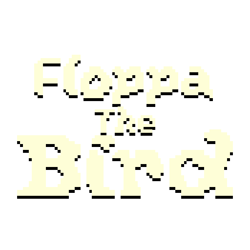
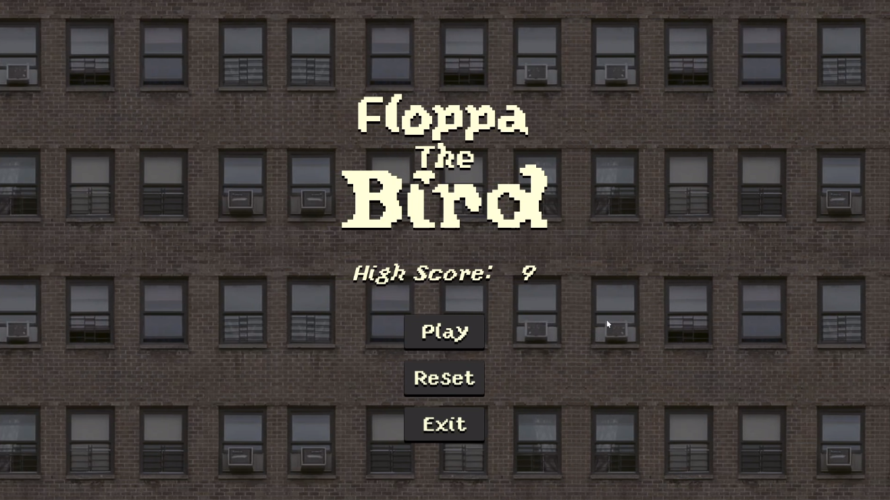
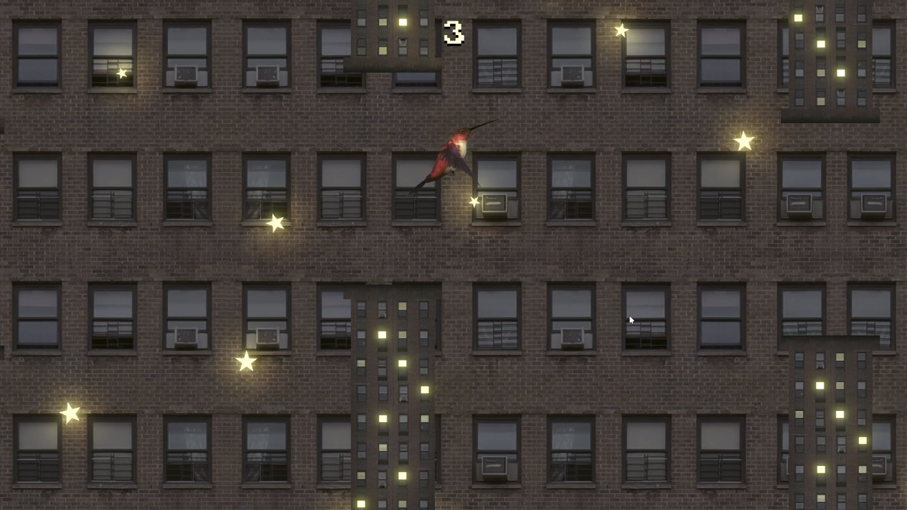
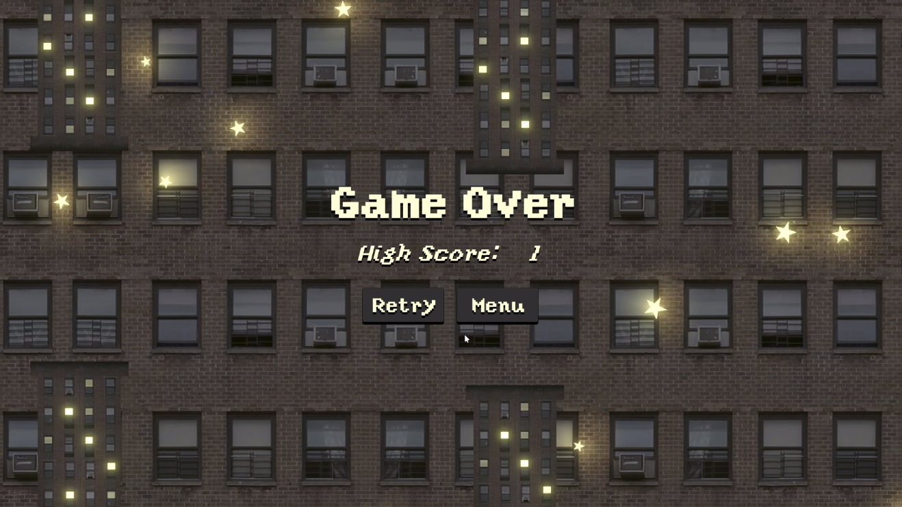

	

<h1 align=center>
	Floppa The Bird
</h1>

	Простая 2D игра на Unity в стиле "Flappy Bird" о птичке по имени Флопа.

	
	

## Описание и демо

Добро пожаловать в увлекательный мир Floppa The Bird! Эта игра представляет из себя захватывающую аркаду, в которой вы
управляете очаровательной птичкой по имени Флопа. В Floppa The Bird вас ждет яркая и атмосферная локация, где звездное
небо и многоэтажные дома создают уникальный визуальный стиль.

Основная цель игры - помочь Флопе долететь как можно дальше, избегая столкновений с высотными зданиями. Управляйте
Флопой, чтобы уклоняться от препятствий, собирать очки и устанавливать новые рекорды. Интуитивное управление позволяет
легко погрузиться в игровой процесс.

	
	
	

Узнайте больше и погрузитесь в атмосферу звездного неба и многоэтажных домов вместе с Флопой!
Посмотрите [демонстрационный ролик](https://youtu.be/tzV2l3ffRrI), чтобы увидеть игру в действии, узнать о ключевых
особенностях и оценить уникальный визуальный стиль.

## Использованные технологии

- Unity — движок игры
- Photoshop — инструмент для создания спрайтов
- Ableton — программа для создания музыки
- [jsfxr](https://sfxr.me/) — веб-приложение для генерации звуковых эффектов в стиле 8-bit

## Уникальные составляющие и проблемы проекта

- Приятный и несложный игровой интерфейс, с необходимым функционалом (начало игры, выход из игры на рабочий стол, сброс
  рекорда, повторение игры и выход из игры в меню)
- Манипуляции с счетом и сохранение рекорда игрока
- Система ввода (прыжок на `Space` или `Mouse Left Click`)
- Управление глобальной логикой
    - Переключение сцен
    - Отслеживание текущего состояния игры
- Управление логикой звука
    - Циклическое проигрывание саундтреков в зависимости от текущей сцены
    - Проигрывание звуковых эффектов в зависимости от события
- Работа с визуальным эффектом частиц, как с игровыми объектами

## Техническое описание

Для работы с проектом **необходим Unity Editor версии 2021.3.17f1**. При использовании редактора другой версии могут
возникнуть проблемы (например несоответствие версий используемых пакетов и вытекающие из этого ошибки).

### `LogicManager.cs`

Логический менеджер. Работает со счетом и рекордами, переключает сцены.

| Тип возвращаемого значения | Имя и назначение                                                                                                                                                                                            |
|:--------------------------:|-------------------------------------------------------------------------------------------------------------------------------------------------------------------------------------------------------------|
|            void            | Start() Инициализирует начальные параметры и состояния игры при запуске сцены. Устанавливает текущую сцену, воспроизводит соответствующую музыку и обновляет текстовые элементы для отображения счетов. |
|            void            | AddScore(int scoreToAdd) Увеличивает текущий счет игрока на заданное значение, обновляет отображение счета и при необходимости обновляет рекордный счет.                                                |
|            void            | ResetHighScore() Сбрасывает рекордный счет игрока до нуля и обновляет отображение рекорда.                                                                                                              |
|            void            | SwitchToTitleScreen() Переключает текущую сцену на экран заглавного меню.                                                                                                                               |
|            void            | SwitchToMainScene() Переключает текущую сцену на основную игровую сцену.                                                                                                                                |
|            void            | RestartScene() Перезапускает текущую сцену. Доступна как команда контекстного меню в Unity Editor.                                                                                                      |
|            void            | SetGameOver() Устанавливает состояние "игра окончена", отключает HUD и активирует экран окончания игры.                                                                                                 |
|            void            | ExitGame() Закрывает приложение. Полезно для завершения игры на устройствах или в тестовой среде.                                                                                                       |
|            void            | OnInspectorGUI() Переопределяет интерфейс инспектора для объекта LogicManager в Unity Editor, позволяя настроить отображение полей в зависимости от выбранного пресета.                                 |
|            void            | SerializePropertyField(string propertyPath) Упрощает отображение полей свойства в инспекторе Unity Editor. Эта функция используется для отрисовки полей свойств в зависимости от выбранного пресета.    |

|       Класс        | Назначение                                                                                                                                                                                                               |
|:------------------:|--------------------------------------------------------------------------------------------------------------------------------------------------------------------------------------------------------------------------|
| LogicManagerEditor | Вложенный класс, используемый в редакторе Unity для настройки пользовательского интерфейса инспектора. Этот класс позволяет редактировать сериализованные поля LogicManager в зависимости от выбранного значения preset. |

|   Тип поля    | Название и назначение                                                                                               |
|:-------------:|---------------------------------------------------------------------------------------------------------------------|
|    Preset     | preset поле типа Preset, указывающее режим текущей сцены (TitleScreen или MainScene).                           |
|     Text      | scoreText текстовое поле для отображения текущего счета игрока.                                                 |
|     Text      | highScoreText текстовое поле для отображения рекорда игрока.                                                    |
|  GameObject   | hud объект интерфейса для отображения HUD.                                                                      |
|  GameObject   | gameOverScreen объект интерфейса для отображения экрана "Game Over".                                            |
| AudioManager  | audioManager ссылка на компонент AudioManager для управления звуком в игре.                                     |
|      int      | playerScore  текущий счет игрока.                                                                               |
|      int      | playerHighScore рекорд игрока.                                                                                  |
| static string | currentSceneName имя текущей сцены, сохраненное в статическом поле для доступа из других экземпляров менеджера. |
|    string     | previousSceneName имя предыдущей сцены.                                                                         |
|     enum      | Preset перечисление, определяющее режим текущей сцены.                                                          |

### `AudioManager.cs`

Аудио менеджер. Отвечает за проигрывание звуков и музыки.

| Тип возвращаемого значения | Имя и назначение                                                                                                                                                                                                                                                                                                                                                          |
|:--------------------------:|---------------------------------------------------------------------------------------------------------------------------------------------------------------------------------------------------------------------------------------------------------------------------------------------------------------------------------------------------------------------------|
|            void            | Awake() Метод, вызываемый при инициализации объекта. Проверяет, существует ли уже экземпляр AudioManager. Если нет, устанавливает текущий экземпляр как одиночный (singleton) и предотвращает его уничтожение при смене сцен. Если экземпляр уже существует, уничтожает текущий объект.                                                                               |
|            void            | PlaySound(string name) Воспроизводит звуковой эффект, заданный по имени. Ищет звук в списке sounds. Если звук не найден, выводит сообщение об ошибке в консоль. Для звука "flap" изменяет высоту тона в диапазоне 0.9-1.1 и воспроизводит его через soundSourceB. Для остальных звуков изменяет высоту тона в том же диапазоне и воспроизводит их через soundSourceA. |
|            void            | PlayMusic(string name) Воспроизводит музыкальную дорожку, заданную по имени. Ищет трек в списке tracks. Если трек не найден, выводит сообщение об ошибке в консоль. Если трек найден, устанавливает его в качестве текущего клипа musicSource и воспроизводит.                                                                                                        |

| Класс | Назначение                                                                                                                                        |
|:-----:|---------------------------------------------------------------------------------------------------------------------------------------------------|
| Sound | Представляет звуковой объект с именем и аудиоклипом. Используется для хранения звуковых эффектов и музыкальных дорожек в списках sounds и tracks. |

|      Тип поля       | Название и назначение                                                                                                                                                          |
|:-------------------:|--------------------------------------------------------------------------------------------------------------------------------------------------------------------------------|
|     AudioSource     | soundSourceA Аудиоисточник для воспроизведения звуковых эффектов с изменяемой высотой тона.                                                                                |
|     AudioSource     | soundSourceB Дополнительный аудиоисточник для воспроизведения звуковых эффектов с изменяемой высотой тона. Используется для звука "flap", чтобы избежать наложения звуков. |
|     AudioSource     | musicSource Аудиоисточник для воспроизведения музыкальных треков.                                                                                                          |
|    List\<Sound\>    | sounds Список звуковых эффектов, доступных для воспроизведения.                                                                                                            |
|    List\<Sound\>    | tracks Список музыкальных треков, доступных для воспроизведения.                                                                                                           |
| static AudioManager | objectInstance Статическое поле для хранения экземпляра AudioManager. Обеспечивает реализацию паттерна одиночка (singleton).                                               |

### `PipeGenerator.cs`

Генератор объектов препятствий со случайной позицией по Y.

| Тип возвращаемого значения | Имя и назначение                                                                                                                                                                                                                                                                        |
|:--------------------------:|-----------------------------------------------------------------------------------------------------------------------------------------------------------------------------------------------------------------------------------------------------------------------------------------|
|            void            | Start() Вызывается один раз при запуске сцены. Выполняет первоначальное создание труб с помощью метода SpawnPipes().                                                                                                                                                                |
|            void            | Update() Вызывается каждый кадр. Увеличивает таймер на значение Time.deltaTime. Если таймер превышает значение spawnRate, создает новые трубы, сбрасывая таймер.                                                                                                                    |
|            void            | SpawnPipes() Создает трубы в случайной позиции по оси Y в диапазоне, заданном с использованием heightOffset. Вычисляет случайную высоту в диапазоне от transform.position.y - heightOffset до transform.position.y + heightOffset и создает экземпляр объекта pipes в этой позиции. |

|  Тип поля  | Название и назначение                                                                                                                 |
|:----------:|---------------------------------------------------------------------------------------------------------------------------------------|
| GameObject | pipes Префаб труб, который будет создаваться и размещаться в сцене.                                                               |
|   float    | spawnRate Частота появления труб в секундах. Определяет, через какой промежуток времени будут создаваться новые трубы.            |
|   float    | heightOffset Смещение по высоте, которое используется для определения случайной позиции по оси Y при создании труб.               |
|   float    | timer Таймер, отслеживающий время, прошедшее с момента последнего появления труб. Сбрасывается при достижении значения spawnRate. |

### `BirdController.cs`

Контроллер игрока.

| Тип возвращаемого значения | Имя и назначение                                                                                                                                                                                                                                                     |
|:--------------------------:|----------------------------------------------------------------------------------------------------------------------------------------------------------------------------------------------------------------------------------------------------------------------|
|            void            | Start() Инициализирует компоненты и переменные при запуске сцены. Находит и сохраняет ссылки на LogicManager, AudioManager, а также компоненты Rigidbody2D, SpriteRenderer и Animator.                                                                           |
|            void            | Update() Вызывается каждый кадр. Проверяет ввод пользователя (нажатие клавиш Space или Mouse0) для выполнения прыжка, если птица жива. Также проверяет позицию птицы по оси Y и вызывает метод Die(), если птица выходит за пределы допустимой зоны (deadZoneY). |
|            void            | Flap() Воспроизводит звук "flap" и анимацию "BirdFlap", устанавливает вертикальную скорость птицы, чтобы она "взлетела" вверх.                                                                                                                                   |
|            void            | Die() Устанавливает флаг isAlive в false, переворачивает спрайт птицы по оси Y и вызывает метод SetGameOver() из LogicManager для отображения экрана окончания игры.                                                                                             |
|            void            | OnCollisionEnter2D(Collision2D collision) Вызывается при столкновении с другим 2D-коллайдером. Воспроизводит звук "hit" и вызывает метод Die().                                                                                                                  |

|    Тип поля    | Название и назначение                                                                                                           |
|:--------------:|---------------------------------------------------------------------------------------------------------------------------------|
|     float      | flapForce Сила, с которой птица взлетает вверх при нажатии клавиши.                                                         |
|  LogicManager  | logicManager Ссылка на объект LogicManager, управляющий логикой игры.                                                       |
|  AudioManager  | audioManager Ссылка на объект AudioManager, отвечающий за воспроизведение звуков.                                           |
|  Rigidbody2D   | rb Ссылка на компонент Rigidbody2D для управления физикой птицы.                                                            |
| SpriteRenderer | sprite Ссылка на компонент SpriteRenderer для управления визуальным отображением птицы.                                     |
|    Animator    | anim Ссылка на компонент Animator для управления анимациями птицы.                                                          |
|      bool      | isAlive Флаг, указывающий, жива ли птица.                                                                                   |
|     float      | deadZoneY Пределы по оси Y, за которые птица не должна выходить. Если птица выходит за эти пределы, вызывается метод Die(). |

### `ParticleAttachment.cs`

Компонент, который привязывает экземпляры префабов к частицам системы ParticleSystem. Он следит за состоянием частиц и
управляет позициями экземпляров префабов, чтобы они совпадали с позициями соответствующих частиц. Используется в объекте
частиц-звезд, так как частицы в форме игровых объектов позволяют работать, например, с уровнем излучаемого света этих
частиц.

| Тип возвращаемого значения | Имя и назначение                                                                                                                                                                                                                                                                                                                                                                                                                             |
|:--------------------------:|----------------------------------------------------------------------------------------------------------------------------------------------------------------------------------------------------------------------------------------------------------------------------------------------------------------------------------------------------------------------------------------------------------------------------------------------|
|            void            | Start() Инициализирует компонент ParticleSystem и массив particles, настраивая его размер в соответствии с максимальным количеством частиц системы.                                                                                                                                                                                                                                                                                      |
|            void            | LateUpdate() Обновляет позиции и активность экземпляров префабов в соответствии с текущими позициями частиц.Получает количество активных частиц. Добавляет недостающие экземпляры префабов в список instances, если их меньше, чем активных частиц. Устанавливает позиции экземпляров префабов в зависимости от системы координат (мировые или локальные). Деактивирует лишние экземпляры префабов, если их больше, чем активных частиц. |

|         Тип поля          | Название и назначение                                                                     |
|:-------------------------:|-------------------------------------------------------------------------------------------|
|        GameObject         | prefab Префаб объекта, который будет создаваться и привязываться к частицам.          |
|      ParticleSystem       | _particleSystem Ссылка на компонент ParticleSystem, с которым работает скрипт.        |
|    List\<GameObject\>     | instances Список экземпляров префабов, привязанных к частицам.                        |
| ParticleSystem.Particle[] | particles Массив частиц, используемый для хранения текущего состояния частиц системы. |

## Лицензия

Проект разрабатывается и распространяется под лицензией [MIT](./LICENSE).
